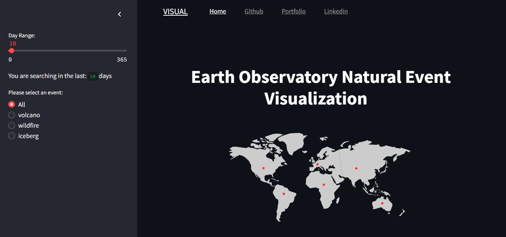
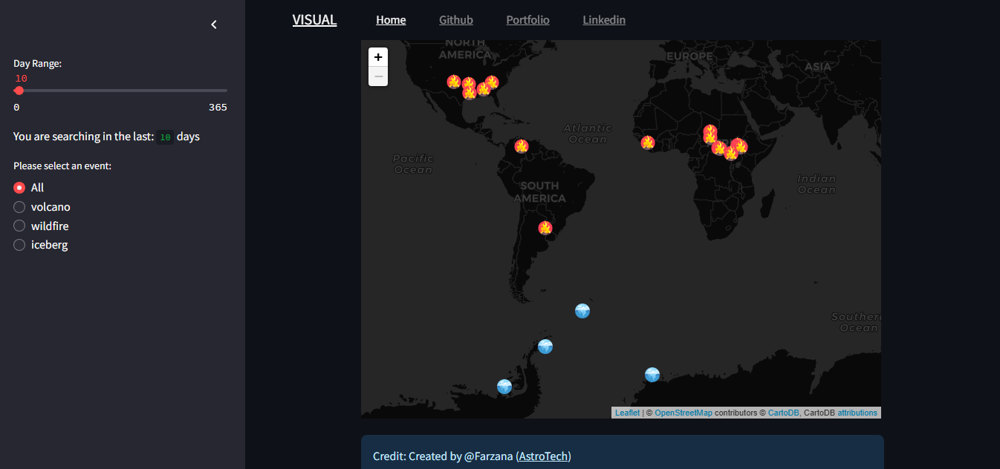
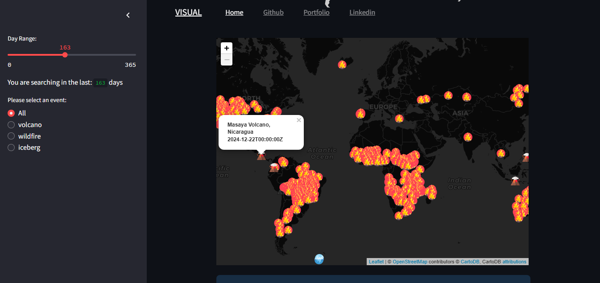

# 🌍 **Earth Observatory Natural Event Tracker**  
_**Visualizing the Power of Nature in Real-Time**_

  

**EONET-VISUAL** is a dynamic and cutting-edge web dashboard built with Python that visualizes real-time natural events around the globe. This project taps into NASA’s Earth Observatory Natural Event Tracker API and presents it with stunning interactive maps powered by **Streamlit** and **Folium**. With this tool, you can monitor wildfires, earthquakes, hurricanes, volcanic eruptions, and much more— all in real-time!

## ✨ **Features**  
#### **Real-time Event Tracking**
- 🌋 Monitor volcanic eruptions, wildfires, earthquakes, and hurricanes in real-time.
- 🔍 Dive into the data provided by **NASA's Earth Observatory Natural Event Tracker API**.

#### **Interactive Maps with Folium**
- 🌐 Explore geographical data in an aesthetically engaging and easy-to-navigate way.
- 📊 Visualize events on beautifully crafted interactive maps.

#### **Streamlit Dashboard**
- 🖥️ Seamlessly interact with your data through a user-friendly interface.
- 🚀 Effortlessly navigate between the events and their insights.

#### **Insightful Analytics**
- 📉 Analyze and uncover important patterns from natural events globally.
- 🧠 Gain deeper insights into Earth’s dynamic processes and phenomena.

---

## 🧑‍💻 **Tech Stack**
- **Python**: Core programming language for backend logic.
- **Streamlit**: For building interactive and sleek web applications.
- **Folium**: Powerful library for creating interactive maps.
- **NASA Earth Observatory Natural Event Tracker API**: Provides the real-time data on global natural events.

---

## 📸 **Project Screenshots**

### Dashboard Overview
  
See how dynamic Earth’s natural events can look with live data!

### Interactive Map in Action
  
Explore detailed visualizations of natural events globally.

---

## 🌎 **Why This Project Matters?**

**Earth Observatory Natural Event Tracker** is more than just a cool project— it's a tool to understand the planet’s ongoing changes.  
- 🌍 **Global Awareness**: Stay updated with real-time data about wildfires, earthquakes, hurricanes, and more.
- 🧑‍🏫 **Educational Value**: Perfect for educators, researchers, or anyone interested in Earth sciences.
- 🌱 **Environmental Responsibility**: Encourages awareness and promotes better responses to natural events.

---

## 🚀 **Future Roadmap**
- **Advanced Analytics**: Integrating machine learning models to predict future events.
- **Alert System**: Real-time notifications for significant natural events.
- **Integration with Global Tools**: Enhancing the platform with more global environmental data sources.

---

## 🌱 **Contributing**

**We welcome contributions!** If you want to help out, here’s how you can get started:

1. **Fork** this repository.
2. **Clone** your fork to your local machine.
3. **Create** a new branch for your feature or fix.
4. **Commit** your changes.
5. **Submit** a pull request for review.

Let’s make Earth’s natural events even more accessible to everyone!

---

## 📜 **License**

This project is licensed under the **MIT License**. For more details, check the [LICENSE](LICENSE) file.

---

## 🌍 **Get Started**
To begin using **EONET-VISUAL**, you’ll need to clone this repository and install the dependencies listed in `requirements.txt`. Here's how you can get started:

```bash
# Clone the repository
git clone https://github.com/RayanGAtech/Earth-Observatory-Natural-Event-Tracker.git

# Navigate to the project directory
cd Earth-Observatory-Natural-Event-Tracker

# Install the dependencies
pip install -r requirements.txt

# Run the app
streamlit run eonat_dashboard.py
```

Enjoy exploring Earth’s dynamic canvas of natural events!

---

### ⚡ **Let’s visualize the world, one event at a time!** ⚡
